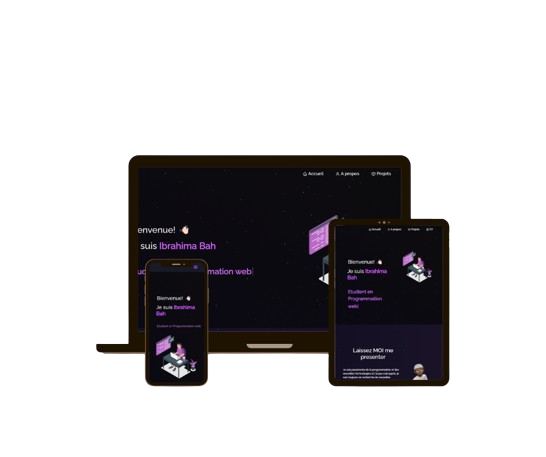

<h2 align="center">
  Site Web Portfolio - v2.0 
  <a href="#" target="_blank">Bah Ibrahima</a>
</h2>

  

 

 &nbsp;
 &nbsp;
 &nbsp;

<h3 align="center">
    🔹
    <a href="https://github.com/bahEzope224/portfolio/issues">Signaler un bug</a> &nbsp; &nbsp;
    🔹
    <a href="https://github.com/bahEzope224/portfolio/issues">Demander une fonctionnalité</a>
</h3>

## Construit Avec

Mon portfolio personnel <a href="https://ibrahima-bah.netlify.app/" target="_blank">Ibrahima Bah</a> qui présente certains de mes projets ainsi que mon CV et mes compétences techniques. 

Ce projet a été réalisé avec ces technologies.

- React.js
- Node.js
- CSS3
- VsCode
- netlify

## Caractéristiques

**📖 Mise en page multi-pages**

**🎨 Stylisé avec React-Bootstrap et CSS avec des couleurs faciles à personnaliser**

**📱 Entièrement Responsive**

## Pour Commencer

Clonez ce dépôt. Vous aurez besoin de `node.js` et `git` installés globalement sur votre machine.

## 🛠 Installation et Instructions de Configuration

1. Installation: `npm install`

2. Dans le répertoire du projet, vous pouvez exécuter: `npm start`

Exécute l'application en mode développement.\
Ouvrez [http://localhost:3000](http://localhost:3000) pour le voir dans le navigateur.
La page se rechargera si vous apportez des modifications.

## Instructions d'Utilisation

Ouvrez le dossier du projet et accédez à `/src/components/`.  
Vous trouverez tous les composants utilisés et vous pouvez éditer vos informations en conséquence.

### Montrez votre soutien

Donnez une ⭐ si vous aimez ce site web !

## credit
 [Soumyajit4419](https://github.com/soumyajit4419/Portfolio). Namaste!
